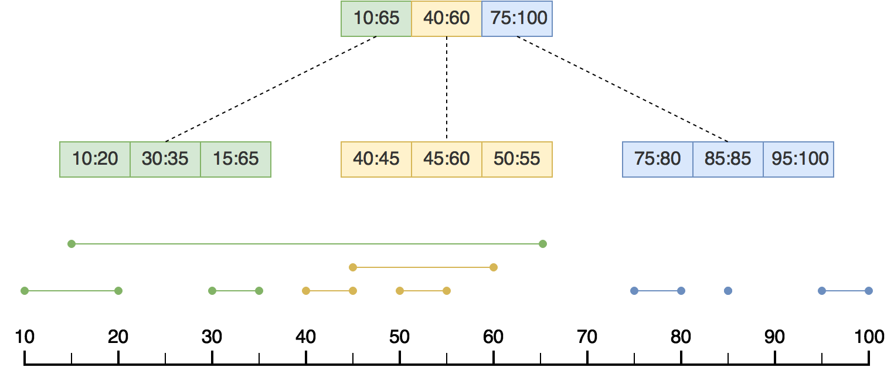

# Sort-tile-recursive One-dimensional R-tree Specification

## Overall Layout
The footer of the index file (the last 26 bytes) should be read first. The footer contains the size in bytes of the chromosome list, which should be read second. An R-tree exists for each chromosome. Trees start from the beginning of the index file in the same order as they appear in the chromosome list. The position of each node of each tree can be inferred from the data contained in the footer and chromosome list. 
```
+vvvvvvvvvvvvvvvvvvvvv+--------------------------+
| Upside Down R-trees | Chromosome List | Footer |
+vvvvvvvvvvvvvvvvvvvvv+--------------------------+
```
## R-tree Format
The Upside down R-tree starts with leaf nodes and ends with the root node. Each level of the tree is stored from left to right. All nodes must be full except for the last node at each level.
                                                                           
The number of nodes at each level and the positions of child nodes are calculated using using the record count and block size.

Take for example a tree that contains 1,000,000 records with a node size of 4096 bytes. The leaf nodes fit a maximum of 256 entries, while the internal nodes fit 512. 1,000,000 is divided by 256 to get 3,907 leaf nodes. 3,907 is divided by 512 to get 8 internal nodes at the next level down. Since 8 is less than 512, the following level contains the root node.

### Generating the Tree
Trees are created by first sorting all entries by the midpoint of their intervals. The tree is then built from the top down with the intervals of each entry in the internal nodes representing the smallest range that contains the child node's intervals. 

### Leaf Nodes
Internal nodes contain at most (block size / 16) entries. Entries are made up of two big-endian 32-bit integers and one 64-bit integer. The first of the 32-bit integers represents the start value of the interval. The second represents the length of the interval. The 64-bit integer represents the offset of the record in the target file. In most cases, the unit for the record offset and length is a byte.

### Internal Nodes
Internal nodes contain at most (block size / 8) entries. Entries are made up of two big-endian 32-bit integers. The first of which represents the start value of the interval while the second represents the length of the interval.

## Chromosome List Format
Each chromosome is described with the following.
```
+vvvvvvvvvvv+-------------------------------------------------------------------------+
| CHROM_STR | RRRRRRRR RRRRRRRR RRRRRRRR RRRRRRRR RRRRRRRR RRRRRRRR RRRRRRRR RRRRRRRR |
+vvvvvvvvvvv+-------------------------------------------------------------------------+
CHROM_STR: Chromosome byte array terminated by null byte.
R: Number of records stored in 8 bytes (big endian).
```
## Footer Format
```
+----------+-------------------+
| BBBBBBBB | CCCCCCCC CCCCCCCC |
+----------+-------------------+
B: Block size (B + 1 Kibibytes)
C: Chromosome list size in bytes 

+-------------------------------------------------------------------------------------------------------------------------------------------------+
| 16 byte UUID used to match index to indexed file                                                                                                |
+-------------------------------------------------------------------------------------------------------------------------------------------------+
| UUUUUUUU UUUUUUUU UUUUUUUU UUUUUUUU UUUUUUUU UUUUUUUU UUUUUUUU UUUUUUUU UUUUUUUU UUUUUUUU UUUUUUUU UUUUUUUU UUUUUUUU UUUUUUUU UUUUUUUU UUUUUUUU |
+-------------------------------------------------------------------------------------------------------------------------------------------------+
+----------------------------------------------------------------+
|   "s1r" string in binary + 4 bytes for version (Major.minor)   |
+----------------------------------------------------------------+
| 01110011 00110001 01110010 MMMMMMMM MMMMMMMM mmmmmmmm mmmmmmmm |
+----------------------------------------------------------------+
```

##

